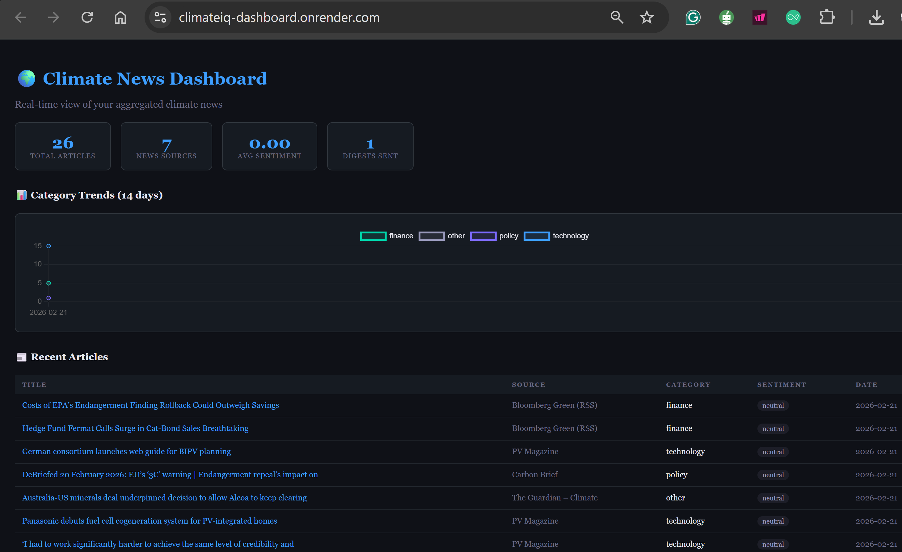
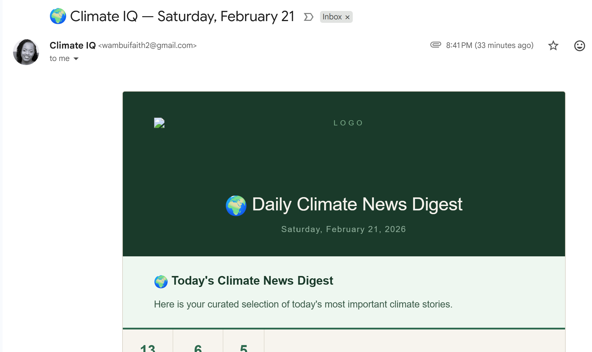

# 🌍 ClimateIQ : Automated AI Climate News Intelligence

<div align="center">


**A fully automated AI pipeline that scrapes, classifies, summarizes, and delivers daily climate news - powered by Google Gemini AI.**

[](https://python.org)
[](https://ai.google.dev)
[](https://flask.palletsprojects.com)
[](https://github.com/features/actions)
[](https://render.com)

[🌐 Live Dashboard](#) · [📬 Sample Digest](#) · [📖 Documentation](#)

</div>

---

## 🎯 Project Overview

ClimateIQ is a **production-deployed, end-to-end automated news intelligence system** built entirely in Python. Every day, with zero human input, it:

1. Wakes up via **GitHub Actions** on a cron schedule
2. Scrapes **10+ RSS feeds** from the world's top climate publications
3. Uses **Google Gemini AI** to classify and summarize each article
4. Scores the **sentiment and emotional tone** of the day's coverage
5. Generates and emails a **beautiful HTML digest** to subscribers
6. Stores everything in a **SQLite database** for trend tracking
7. Auto-generates a **weekly briefing** every Friday

> Built to solve a real problem: staying on top of climate news across dozens of sources is time-consuming. ClimateIQ does it automatically and intelligently.

---

## 🚀 Live Demo

<div align="center">

| Web Dashboard | Email Digest | Mood-O-Meter |
|:---:|:---:|:---:|
|  |  |  |
| Browse articles by category | Daily HTML digest in your inbox | Sentiment tracking across sources |

</div>

---

## ✨ Key Features

### 🤖 AI-Powered Intelligence
- **Google Gemini AI** classifies every article into 6 climate themes
- AI-generated **3-sentence summaries** for each top story
- Smart deduplication — the same story is never repeated across sources

### 📡 Multi-Source Aggregation
Scrapes 13+ trusted sources including Carbon Brief, Bloomberg Green, The Guardian, Reuters Climate, BBC Climate & Science, NASA Earth, Yale Environment 360, and more.

### 🎭 Sentiment Analysis
- Daily **mood-o-meter** scores the overall tone of climate coverage
- Tracks whether headlines are becoming more hopeful or more alarming over time

### 📬 Automated Email Digest
- Professionally designed **HTML email** with categorized articles
- Daily digest + auto-generated **Friday weekly roundup**
- Delivered via SMTP with zero manual effort

### 🖥️ Flask Web Dashboard
- Browse all scraped articles in real time
- Filter by category, source, and date
- View sentiment history and source statistics

### ⚙️ Fully Automated Pipeline
- **GitHub Actions** triggers the full pipeline daily on a cron schedule
- Runs entirely in the cloud - no local machine needed
- Deployed on **Render** for 24/7 availability

---

## 🛠️ Tech Stack

```
Backend          Python 3.10+
AI / LLM         Google Gemini API
Web Framework    Flask
Database         SQLite
Scraping         BeautifulSoup4, feedparser
Email            smtplib (SMTP)
Automation       GitHub Actions (cron schedule)
Deployment       Render
Timezone         Africa/Nairobi (EAT, UTC+3)
```

---

## 📁 Architecture

```
climateiq/
│
├── 📂 scrapers/          # RSS feed scrapers — one per source
├── 📂 processors/        # Gemini AI classification, summarization & sentiment
├── 📂 database/          # SQLite connection, schema, deduplication
├── 📂 mailer/            # HTML email template + SMTP delivery
├── 📂 dashboard/         # Flask web app (routes, templates, static)
├── 📂 scheduler/         # Pipeline orchestration & runner
├── 📂 config/            # App settings and constants
├── 📂 output/            # Generated digests stored locally
│
├── 📂 .github/
│   └── workflows/
│       └── daily_digest.yml   # GitHub Actions automation
│
├── .env.example          # Environment variable template
├── requirements.txt
└── README.md
```

---

## ⚡ How The Pipeline Works

```
GitHub Actions (cron: daily 6AM UTC = 9AM EAT)
        │
        ▼
  scheduler/runner.py
        │
        ├──▶ scrapers/     ──▶ Fetch RSS feeds from 13+ sources
        │
        ├──▶ database/     ──▶ Deduplicate against history
        │
        ├──▶ processors/   ──▶ Gemini AI: classify + summarize + sentiment
        │
        ├──▶ database/     ──▶ Save new articles to SQLite
        │
        └──▶ mailer/       ──▶ Build HTML digest + send email
```

---

## 🧰 Setup & Installation

### Prerequisites
- Python 3.10+
- Google Gemini API key ([get one free](https://ai.google.dev))
- Gmail account with App Password enabled

### 1. Clone the repo
```bash
git clone https://github.com/yourusername/climateiq.git
cd climateiq
```

### 2. Create virtual environment
```bash
python -m venv venv
source venv/bin/activate        # Mac/Linux
venv\Scripts\activate           # Windows
```

### 3. Install dependencies
```bash
pip install -r requirements.txt
```

### 4. Set up environment variables
```bash
cp .env.example .env
```

Edit `.env` with your credentials:
```env
GEMINI_API_KEY=your_gemini_api_key_here
SMTP_HOST=smtp.gmail.com
SMTP_PORT=587
SMTP_USER=your@gmail.com
SMTP_PASS=your_app_password
RECIPIENT_EMAIL=recipient@email.com
```

### 5. Run a test
```bash
# Dry run — scrapes but doesn't send email
python -m scheduler.runner --dry-run

# Full run — scrapes, classifies, and sends digest
python -m scheduler.runner --now
```

### 6. Start the dashboard
```bash
flask --app dashboard/app.py run
```
Visit [http://localhost:5000](http://localhost:5000)

---

## ☁️ Deployment

### Render (Web Dashboard)
1. Connect GitHub repo to [Render](https://render.com)
2. **Build Command:** `pip install -r requirements.txt`
3. **Start Command:** `gunicorn dashboard.app:app`
4. Add all `.env` variables under **Environment Variables**

### GitHub Actions (Daily Automation)
The pipeline runs automatically via `.github/workflows/daily_digest.yml`.

Add your secrets under **GitHub Repo → Settings → Secrets and variables → Actions:**

| Secret | Description |
|---|---|
| `GEMINI_API_KEY` | Your Google Gemini API key |
| `SMTP_HOST` | Your SMTP server |
| `SMTP_PORT` | SMTP port (587) |
| `SMTP_USER` | Your sending email |
| `SMTP_PASS` | Your email app password |
| `RECIPIENT_EMAIL` | Digest recipient email |

To trigger manually: **Actions tab → Daily Climate Digest → Run workflow**

---

## 📊 Categories Tracked
<!-- AUTO:CATEGORIES_START -->

| # | Category | Sources | Example Topics |
|---|---|---|---|
| 1 | 🏛️  Policy & Regulation | African Climate Wire, Carbon Brief, E&E News (Climate) | Government policy, legislation, international agreements, treaties, regulations, COP summits |
| 2 | ⚡  Clean Technology | CleanTechnica, Electrek, PV Magazine +1 more | Renewable energy, EV, battery storage, carbon capture, green hydrogen, clean tech startups |
| 3 | 💰  Climate Finance | Bloomberg Green (RSS), GreenBiz | ESG investing, carbon markets, green bonds, climate risk, sustainable finance, net-zero pledges |
| 4 | 🌪️  Disasters & Extreme Weather | NASA Climate, NOAA News, ReliefWeb (Climate) | Floods, wildfires, droughts, hurricanes, heatwaves, sea level rise, extreme weather events |
| 5 | 🔬  Science & Research | Nature Climate Change, Yale Environment 360, Carbon Brief (Science tag) | Climate research, IPCC reports, emissions data, ocean temperatures, ice melt, scientific studies |
| 6 | 🌐  General Climate News | Climate Home News, Inside Climate News, Reuters Climate +1 more | Any climate-related news that doesn't fit the above categories |

<!-- AUTO:CATEGORIES_END -->

---

## 📡 Sources

<!-- AUTO:SOURCES_START -->

| # | Source | Category | Feed URL |
|---|---|---|---|
| 1 | African Climate Wire | 🏛️  Policy & Regulation | [RSS](https://africanclimatewire.org/feed/) |
| 2 | Carbon Brief | 🏛️  Policy & Regulation | [RSS](https://www.carbonbrief.org/feed) |
| 3 | Climate Home News | 🌐  General Climate News | [RSS](https://www.climatechangenews.com/feed/) |
| 4 | Inside Climate News | 🌐  General Climate News | [RSS](https://insideclimatenews.org/feed/) |
| 5 | E&E News (Climate) | 🏛️  Policy & Regulation | [RSS](https://www.eenews.net/rss/climate) |
| 6 | CleanTechnica | ⚡  Clean Technology | [RSS](https://cleantechnica.com/feed/) |
| 7 | Electrek | ⚡  Clean Technology | [RSS](https://electrek.co/feed/) |
| 8 | PV Magazine | ⚡  Clean Technology | [RSS](https://www.pv-magazine.com/feed/) |
| 9 | Carbon Brief (Energy tag) | ⚡  Clean Technology | [RSS](https://www.carbonbrief.org/tag/energy/feed) |
| 10 | Bloomberg Green (RSS) | 💰  Climate Finance | [RSS](https://feeds.bloomberg.com/green/news.rss) |
| 11 | Reuters Climate | 🌐  General Climate News | [RSS](https://feeds.reuters.com/reuters/environmentNews) |
| 12 | GreenBiz | 💰  Climate Finance | [RSS](https://www.greenbiz.com/feeds/news) |
| 13 | NASA Climate | 🌪️  Disasters & Extreme Weather | [RSS](https://climate.nasa.gov/news/rss.xml) |
| 14 | NOAA News | 🌪️  Disasters & Extreme Weather | [RSS](https://www.noaa.gov/news/feed) |
| 15 | ReliefWeb (Climate) | 🌪️  Disasters & Extreme Weather | [RSS](https://reliefweb.int/updates/rss.xml?primary_country=0&source=0&theme=4590) |
| 16 | Nature Climate Change | 🔬  Science & Research | [RSS](https://www.nature.com/nclimate.rss) |
| 17 | The Guardian – Climate | 🌐  General Climate News | [RSS](https://www.theguardian.com/environment/climate-crisis/rss) |
| 18 | Yale Environment 360 | 🔬  Science & Research | [RSS](https://e360.yale.edu/feed) |
| 19 | Carbon Brief (Science tag) | 🔬  Science & Research | [RSS](https://www.carbonbrief.org/tag/science/feed) |

> **19 sources** across **6 categories** — edit `config/sources.py` to add more.

<!-- AUTO:SOURCES_END -->

---

## 🗺️ Roadmap

- [ ] Migrate to PostgreSQL for persistent cloud storage
- [ ] Add category trend charts to dashboard
- [ ] Multi-recipient subscription management
- [ ] WhatsApp / Slack digest delivery
- [ ] Source credibility scoring
- [ ] Docker containerization
- [ ] Public API endpoint for digest data

---

## 💡 What I Learned Building This

- Designing and orchestrating a **multi-stage automated pipeline** from scratch
- Integrating **LLM APIs** (Gemini) for real-world classification and summarization
- Building **production-ready Flask apps** with proper routing and templating
- **Cloud deployment** on Render with environment-based configuration
- Using **GitHub Actions** for fully automated scheduling — no server required
- Handling **timezone-aware datetime** across systems (UTC → EAT)
- Writing resilient scrapers that handle inconsistent RSS feed formats

---

## 👩‍💻 Author

**Faith Wambui**

> *"I built ClimateIQ because staying on top of climate news across dozens of sources takes hours. I wanted an AI to do the reading for me — and deliver only what matters, every morning."*

- 🐙 GitHub: [@Faith-Wambui](https://github.com/Faith-Wambui)
- 💼 LinkedIn: [linkedin.com/in/ms-faith-wambui](https://linkedin.com/in/ms-faith-wambui)
- 📧 Email: wambuifaith2@gmail.com

---

## 📄 License

This project is licensed under the MIT License — see the [LICENSE](LICENSE) file for details.

---

<div align="center">

**⭐ If you found this project interesting, please give it a star!**


</div>
